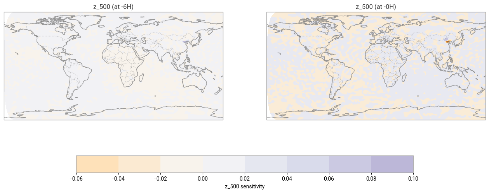

# From SHAP to AIFS — Explainable AI for Weather and Climate

*Workshop handout — Climademics Summer School, 2026-07-03 (working title)*

## Core message

As AI models grow more skillful, their interpretability from a physical
perspective tends to shrink — and in high-stakes settings like natural
hazards, that erosion of interpretability becomes a barrier to trust and
adoption. Explainable AI (XAI) methods counter this by giving experts a way
to inspect a model's reasoning rather than only its output. The good news
for this audience: much of the intuition already exists in geoscience — the
sensitivity/adjoint thinking behind 4D-Var data assimilation transfers
directly to gradient-based XAI for modern AI weather models.

## Part 1 cheat sheet: classic XAI on tabular data

Four methods, applied to a Palmer Penguins classifier, in increasing order
of robustness:

| Method | Question it answers | One-line pitfall |
|---|---|---|
| Tree / impurity importance | Which features did the trees split on most, and how much did that reduce impurity? | Biased toward high-cardinality/one-hot-encoded features and correlated features; can rank pure noise above real signal. |
| Permutation importance | How much worse does the model get when a feature's values are shuffled? | Model-agnostic and more trustworthy, but correlated features share/dilute credit, and results depend on train vs. test data choice. |
| PDP / ICE | On average (PDP) and per-instance (ICE), how does the prediction change as one feature varies? | Averaging (PDP) hides interactions between features and can mask individuals; curves can extrapolate into sparse or empty regions of feature space. |
| SHAP | How much did each feature push this individual prediction away from the average (local), and overall (global)? | Explains the model's behaviour, not necessarily the world — a high-ranked feature (e.g. sex) may be a proxy/confound rather than a causal driver. |

Each method is demonstrated worked-example-first, then deliberately broken
with a short exercise (e.g. adding a random-noise feature) so the pitfall is
felt, not just described.

## Part 2: backward sensitivities in AIFS

The instructor demo applies the same questioning spirit to ECMWF's AIFS
(AI Forecasting System), an operational AI weather model. A unit
perturbation is injected into the 6-hour 2m-temperature forecast near the
Bohai Sea / China coast (40°N, 120°E), and reverse-mode automatic
differentiation (a vector–Jacobian product — the same mathematical object as
an adjoint model) propagates that perturbation backward through the network
to the initial atmospheric state. The result is a sensitivity map: which
input variables, locations, and vertical levels most influenced that single
forecast value.

*Sensitivity of the 6-hour 2t forecast to the initial 500 hPa geopotential
field (z_500), global view. Structure well upstream of the perturbation
point traces out the synoptic-scale flow feeding into the forecast — the
same kind of teleconnection pattern a forecaster would look for by eye.*

**The bridge back.** Permutation importance and SHAP are *perturbation-based*
and *model-agnostic*: they probe a model by changing inputs and watching the
output, treating the model as a black box. Backward/adjoint sensitivities
are *gradient-based* and *model-aware*: they require access to the model's
internals via automatic differentiation, exactly as adjoint models in NWP
and 4D-Var require the tangent-linear/adjoint of the forecast operator. If
you already think in terms of sensitivities and adjoints from data
assimilation, you already know how to think about this class of XAI method
— the transfer is direct, not metaphorical.

## Go further

- **ml.recipes** (Part 1 methodology basis): Dramsch, J. S., & Maggio, V.
  (2022). *ML Recipes — Increase citations, ease review & foster
  collaboration* (Version PyData-Global-2022) [Computer software].
  https://github.com/JesperDramsch/ml-for-science-reproducibility-tutorial
  · DOI: [10.5281/zenodo.10381234](https://doi.org/10.5281/zenodo.10381234)
- **Framing paper**: Dramsch, J.S., Kuglitsch, M.M., Fernández-Torres,
  M.-Á., Toreti, A., Albayrak, R.A., Nava, L., Ghaffarian, S., Cheng, X.,
  Ma, J., Samek, W., Venguswamy, R., Koul, A., Muthuregunathan, R. & Hrast
  Essenfelder, A. (2025). Explainability can foster trust in artificial
  intelligence in geoscience. *Nature Geoscience*.
  https://doi.org/10.1038/s41561-025-01639-x
- **This workshop's repository** (notebooks, solutions, artifacts):
  `github.com/jesperdramsch/xai-weather-workshop`
  *(not yet pushed publicly as of this writing — push before distributing
  this handout so the link resolves.)*

---
*Palmer Penguins data: Dr. Kristen Gorman and the Palmer Station, Antarctica
LTER Program, accessed via the `palmerpenguins` package (Muhammad
Chenariyan Nakhaee, MIT licensed). AIFS sensitivity artifacts adapted from
ECMWF's 2025 ML training course materials (`ecmwf-training` on GitHub),
reused with the instructor's authority as a course contributor; helper
routines `perturbation.py`/`sensitivities.py` originate from the
Apache-2.0-licensed `anemoi-inference` package. This handout and repository
are MIT licensed, Copyright (c) 2026 Jesper Dramsch.*
