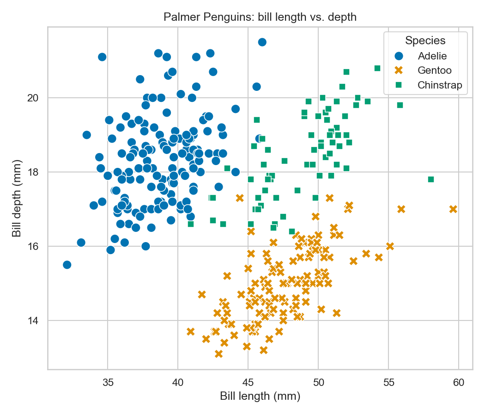
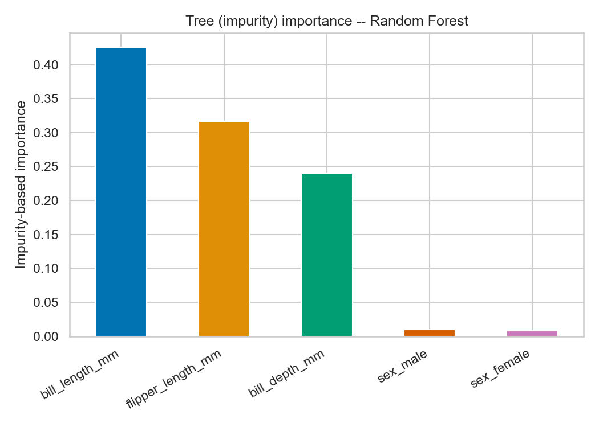
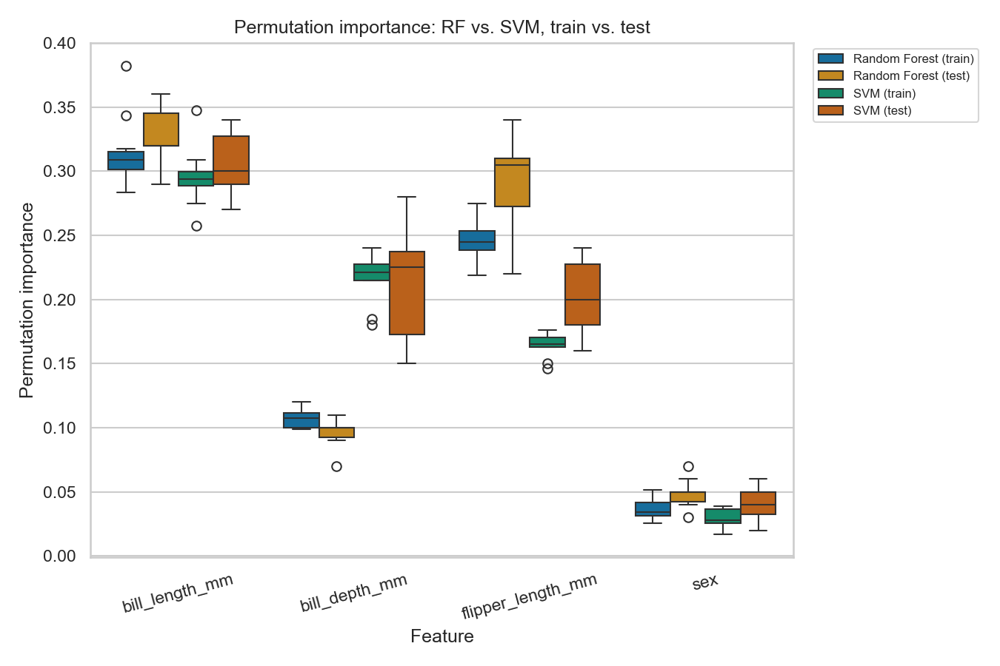
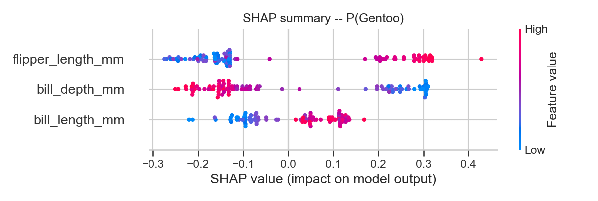
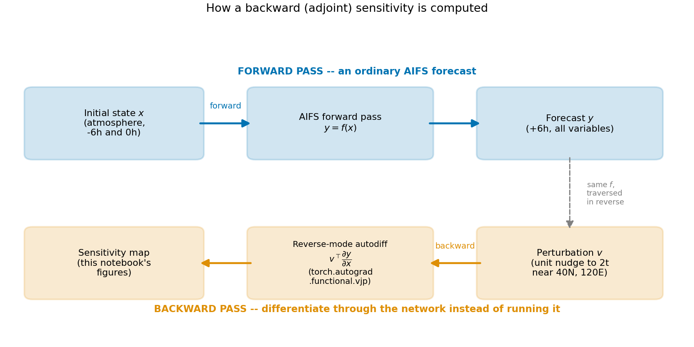
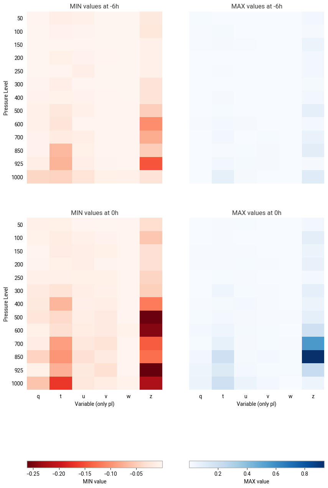
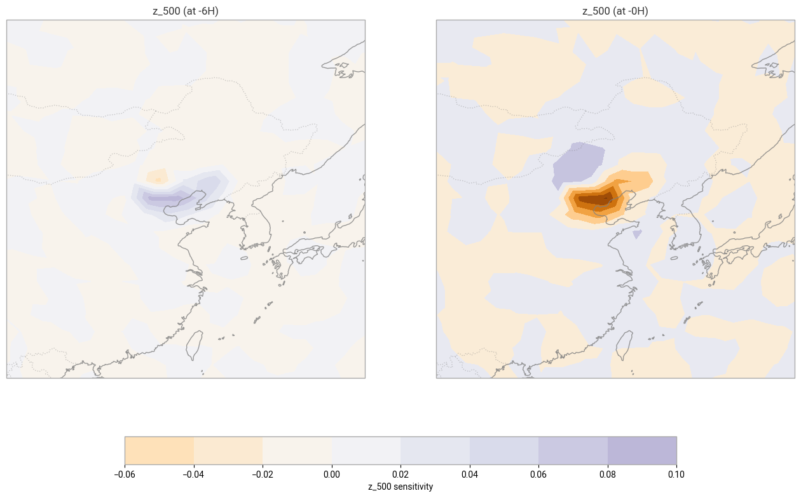
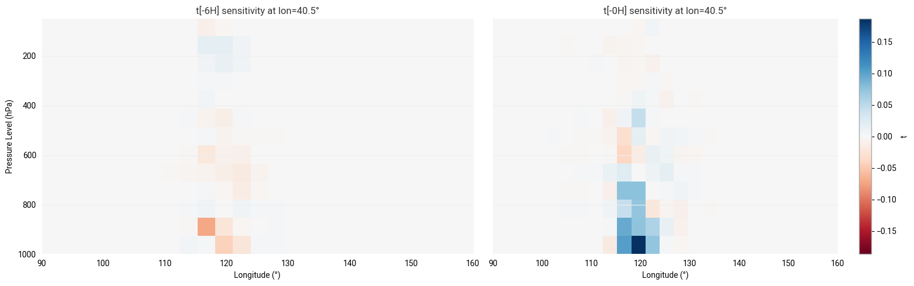

<!-- _class: invert lead -->

# XAI in Geoscience: From Feature Importance to Adjoint Sensitivities <!--fit-->

Jesper Dramsch (they/them) · ECMWF
Climademics Summer School, 2026-07-03

Part 1: hands-on (Colab) · Part 2: instructor demo

---

## Why explainability, why now

&nbsp;

-   AI models: more skill, less physical interpretability
-   High-stakes settings -> that erodes trust
-   XAI: reveal the reasoning, rebuild the trust

---

## What XAI gives you

&nbsp;

-   A **magnifying lens** into the model
-   Catches spurious correlations early
-   Can motivate new science

---

## The adoption gap

&nbsp;

-   2.3M arXiv abstracts screened (2007–2022)
-   25.5% mention AI -- only **6.1%** mention XAI
-   Gap: flat for 15 years

---

## Why the gap exists

&nbsp;

-   Non-adopters: no time, not no interest
-   Almost everyone plans to adopt eventually
-   Source: ITU/WMO/UN survey

---

<!--
_header: ""
_footer: ""
_paginate: false
-->

---

## Where / when / what

&nbsp;

-   **Where**: tornadoes, eruptions, floods
-   **When**: lead time
-   **What**: feature importance
-   Part 1 -> what · Part 2 -> where + when

---

## Challenges

&nbsp;

-   XAI was built for images -- geodata is different
-   Pixel attribution ≠ physical meaning
-   Still an open research question

---

## Four recommendations

&nbsp;

-   **Demand** it
-   **Resource** it -- read the docs, benchmark
-   **Partner** on it
-   **Integrate** it into workflows

---

## Today: Resources, in action

&nbsp;

Classic tabular XAI **-> ** state-of-the-art AI weather model

Your adjoint/sensitivity intuition already transfers.

---

<!-- _class: invert lead -->

# Part 1: Classic XAI <!--fit-->

From Penguins to Pitfalls

---

## The dataset

-   Palmer Penguins
-   3 species, 4 features
-   `RandomForestClassifier` + `SVC`
-   `01_classic_xai.ipynb` -- runs on Colab free tier

---

## Tree

-   Free -- read off the fitted model
-   **Where it misleads**: cardinality + correlation bias

---

## Exercise 1

&nbsp;

-   Add a random-noise feature
-   Re-run tree importance
-   Why does noise get nonzero importance?

---

## Permutation

-   Shuffle one feature -> measure the damage
-   Model-agnostic
-   Train/test agreement = overfitting check

---

## Exercise 2

&nbsp;

-   Same noise trick, permutation importance this time
-   Does the noise feature show up now?
-   Compare to Exercise 1

---

## Method 3: PDP / ICE

&nbsp;

-   PDP: average response curve
-   ICE: per-individual curves
-   **Where it misleads**: averaging hides interactions

---

## Exercise 3

&nbsp;

-   Add ICE curves for bill depth
-   Find a penguin that disagrees with the average

---

## SHAP

-   Game-theoretic, per-prediction attribution
-   **Where it misleads**: explains the model, not the world

---

## Exercise 4

&nbsp;

-   Compare SHAP ranking to permutation ranking
-   Where do they disagree, and why?

---

<!-- _class: invert lead -->

# Part 2: AIFS Backward Sensitivities <!--fit-->

An instructor demo

---

## The experiment

&nbsp;

-   Model: **AIFS**, O48, 6h lead time
-   Unit nudge to 2m temperature, Bohai Sea coast
-   `torch.autograd.functional.vjp`
-   Which inputs drove that forecast?

---

## How it works

-   Forward: state → AIFS → forecast
-   Backward: perturbation → autodiff → sensitivity map
-   Same math as an adjoint in 4D-Var

---

## Live demo: 2 inputs, by hand

&nbsp;

-   2 inputs → 4 hidden units → 1 output
-   **Act 1**: drag `x1`/`x2`, watch `y` respond
-   **Act 2**: fix the point, drag `v` (the output perturbation)
-   Backward pass is linear in `v`

---

## Overview first

-   Overview across all levels, both variables
-   Guides where to zoom in next

---

## Interactive map

-   `2t`: self-check -- signal sits on the perturbation point
-   `z_500`: paired +/- structure, upper-air dynamics

---

## Vertical view

-   Cross-section through the perturbation point
-   Boundary layer vs. free troposphere

---

<!-- _class: invert lead -->

# You already know this <!--fit-->

---

## Bridge back

&nbsp;

-   Perturbation-based, model-agnostic: **Part 1**
-   Gradient-based, model-aware: **Part 2**
-   Adjoint sensitivities: old friends from 4D-Var
-   Not a new skill -- a new application

---

## If we had 90–120 minutes

&nbsp;

-   Part 1: counterfactuals, LIME, fairness probes
-   Part 2: live inference, new location, new lead time
-   See `extensions.md`

---

<!-- _class: invert lead -->

# Recap <!--fit-->

---

## The arc

&nbsp;

-   Framing: the gap is real, trust matters
-   Part 1: naive → robust, on penguins
-   Part 2: same thinking, an operational weather model
-   Your domain expertise transfers

---

## Resources

&nbsp;

-   ml.recipes -- Dramsch & Maggio (2022)
-   Dramsch et al. (2025), *Nature Geoscience*
-   `github.com/jesperdramsch/xai-weather-workshop`

---

## Acknowledgements

&nbsp;

-   Part 2: ECMWF / ecmwf-training course
-   `perturbation.py`/`sensitivities.py`: Apache-2.0, Anemoi contributors
-   This repo: MIT, © 2026 Jesper Dramsch

---

<!-- _class: invert lead -->

## Questions?

&nbsp;

Jesper Dramsch (they/them) · ECMWF
ai-in-public-health@rki.de

`github.com/jesperdramsch/xai-weather-workshop`
